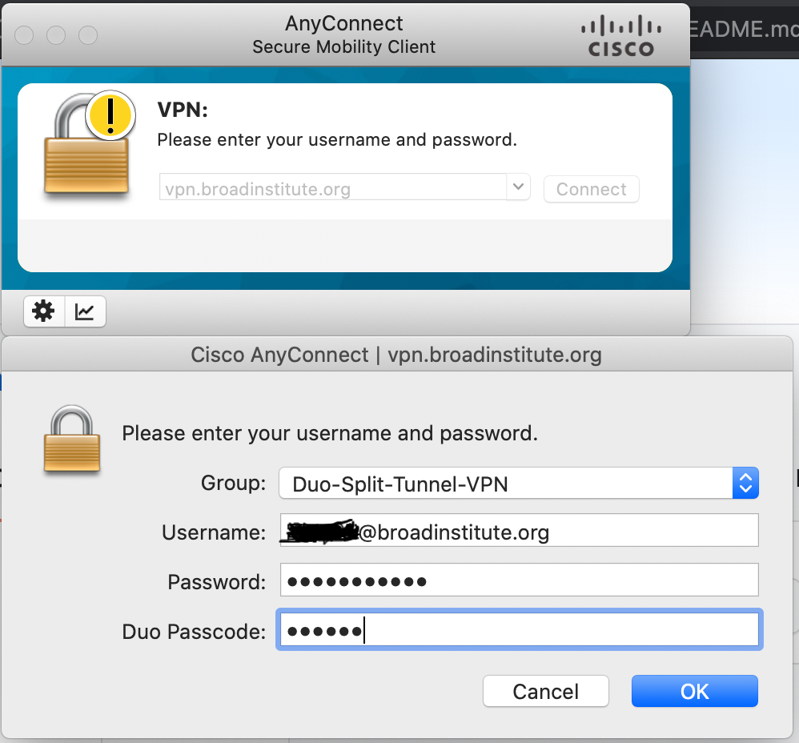

# cromwell_for_ML
Cromwell_for_ML leverages *cromwell*, *WDL* and *Neptune* to train Machine Learning model at scale and nicely log the results for nice visualization and comparison. 
Possible use cases include:
1. hyperparameter optimization 
2. code development when multiple experiments are required.

In practice the solution boild down to running the command: 
> *./submit_neptune_ml.sh neptune_ml.wdl WDL_parameters.json --ml ML_parameters.json*

where:
1. *submit_neptune_ml.sh* is a wrapper around cromshell
2. *neptune_ml.wdl* is a WDL which specify the following operation: \
	a. turn on/off VM machine \
	b. checkout the correct version of the code from the github repository \
	c. launch the training of ML model 
3. *WDL_parameters.json* contains few parameter such as the name of the git repository, and commit to use
4. *ML_parameters.json* is a file with all the parameters necessary to specify the ML_model (learning_rate, etc)

In many situations the users should be able to only change the values in the *WDL_parameters.json* and *ML_parameters.json* to make the code run.

## Setup
To work you need to install both cromshell and Neptune.

### Neptune
1. Visit the website *https://neptune.ai/* and sign-up for a free account (sign-up bottom is in the top-right)
2. Run the jupyter notebook *AUXILIARY_FILES/TEST/test.ipynb*
3. If notebook executes sucesfully, then Neptune is installed and workingly properly

### Cromshell/Cromwell
1. Install *cromshell* (follow the instruction here: *https://github.com/broadinstitute/cromshell*)
2. If working remotely, connect to the Cisco Split-Tunnel VPN 

3. Modify the file *AUXILIARY_FILES/test.json* to reflect your *NEPTUNE_API_TOKEN* and your *NEPTUNE_PROJECT* 
(use the same values you used in *AUXILIARY_FILES/test_neptune.ipynb*)
4. run the commands:
> *cd AUXILIARY_FILES*
> *cromshell submit test.wdl test.json*
> *cromshell list -u -c*
you should see a list of all the runs submitted by cromshell. The last line should look like this:

6. repeat the command *cromshell list -u -c* till you see the job has completed. 
At that point log into the neptune website *https://neptune.ai/* to see the results. 

Test the cromshell by running the command:
> *cromshell list -u -c*
If the turtles moves then cromshell is working correctly.

### Cromshell and Neptune together
We are now going to use *cromshell* and *Neptune* to train a non-trivial ML model and log the results.
The conceptual overview is:
1. Cromshell will start a google Virtual Machine (VM) and localize all relevant files from google buckets to VM
2. on the VM we will checkout a github repo, and run the code *python main.py* which uses all the files we have localized to train a ML model
3. Neptune will log the metric
4. Cromshell turns of the VM

#### Preparation (one-time):
1. modify the first line of the file *AUXILIARY_FILES/ML_parameters.json"* to reflect *your_neptune_username*,
1. modify the file */AUXILIARY_FILES/credentials.json* by writing your own *NEPTUNE_API_TOKEN*
2. copy the files */AUXILIARY_FILES/data_train.pt*, */AUXILIARY_FILES/data_test.pt* and */AUXILIARY_FILES/credentials.json* to your own google bucket
3. modify the file */AUXILIARY_FILES/WDL_parameters.json* to reflect the location where you copied the files *data_train.pt*, *data_train.pt* and *credentials.json* 
4. modify the first line on the file */AUXILIARY_FILES/submit_neptune_ml.sh* to set your own google_bucket as the *DEFAULT_BUCKET*

Now we can finally train a ML model on the cloud and track all metrics using Neptune.
1. Navigate to the directory *AUXILIARY_FILES*
2. run the command:
> *./submit_neptune_ml.sh neptune_ml.wdl WDL_parameters.json --ml ML_parameters.json*
3. run the command:
> *cromshell list -u -c*
The last row should list the run you just submitted and look like this (but listed as "Running" not "Succeded"):

4. Log into the Neptune website and see your results streaming in. After a while your results should look like this:

#----------------------------------

FROM HERE:
1. sample_WDL and with sample submission
2. how to use it for you own code
# Use case
Now that we have tested that everything works correctly you can train your own ML model.

### Sample run
1. cd cromwell_for_ML
2. ./submit_wdl_workflow.sh jupyter.wdl parameters_for_wdl.json gs://ld-results-bucket/input_jsons
   (the first time you will be promped to specify the Cromwell server. \
    Type: https://cromwell-v47.dsde-methods.broadinstitute.org \
    Then run the command again)

### Usage
1. Create a github repo similar to https://github.com/dalessioluca/fashion_mnist_vae.git. \
   In particular the jupyter notebook:\
   a. expect a file called parameters.json in the execution_dir\
   b. produce outputs in execution_dir/dir_output
2. modify the file parameters_for_wdl.json accordingly:\
   a. has few entries named "wdl.xxx" with the parameters for the wdl workflow\
	- if "wdl.alias" is present the cromshell run will get that alias\
	- if "wdl.bucket_output" is present the results will be copied from the default execution bucket to that bucket_output 
   
   b. has many other parameters with arbitrary nested structure to be read by the jupyter notebook
   

### File descirption
1. submit_wdl_workflow.sh -> bash script which launches cromshell in a smart way
2. jupyter.wdl -> workflow in wdl 
3. parameters_for_wdl.json -> all the parameters that the notebook needs to run

### Running Jupyter:

Let's compare the manual workflow and the WDL empowered workflow:

#### Manual Usage: 
You:
1. start a VM machine
2. git pull the code from your repository
3. copy the train_data and test_data inside the execution directory 
4. copy the parameters.json inside the execution directory
5. run the jupyter notebook from top-to-bottom
6. save the results into a google bucket
7. turn off the VM machine

#### WDL Usage
You:
1. on local machine edit the parameters_for_wdl.json as desired
2. run the command:\
   submit_wdl_workflow.sh jupyter.wdl parameters_for_wdl.json gs://ld-results-bucket/input_jsons 

   Here: 
   - jupyter.wdl is the file specifying the workflow and does **not** need to be changed
   - gs://ld-results-bucket/input_jsons is a bucket where the parameters file will be copied and the path_to_json will be passed to the workflow	
   
3. enjoy! The progress and results can be retieved with the commands: 
   - cromshell list -c -u
   - cromshell metadata
   - cromshell status
   
4. After sucessfull completion the results can be found:
   - in the cromwell execution bucket: broad-methods-cromwell-exec-bucket-v47/jupyter_localize
   - in the output bucket if specified in the parameters.json: for example gs://ld-results-bucket
